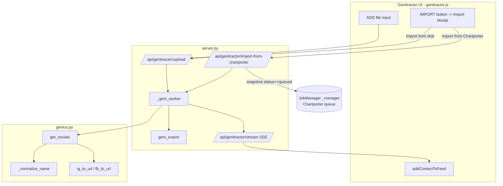

# Design Document

## Overview

This feature reshapes **Genitractor** (the contact-extraction tool) around **Instagram and Facebook only**, makes its artist matching aggressive-but-flagged to maximize IG/FB capture, strips social columns out of **Chartporter** (the audit tool), and adds an **Import** control to the Genitractor queue bar that can pull files either from disk or directly from the Chartporter queue. All existing audit/classification logic, the plain-CSV export format, the SSE/queue semantics, and the branch's prior bug fixes are preserved byte-for-byte.

The work touches exactly these files (verified against the running app on `feat/catalog-audit-v5`):

| File | Role today | Change |
|------|-----------|--------|
| `app/sources/genius.py` | `get_socials()` → Genius `GET /search` then `GET /artists/:id`; `_normalize()` strips all non-alphanumeric | Replace `_normalize` with a richer name-normalizer; replace blind first-hit / 3-char-prefix selection with balanced top-10 matching + `match_confidence`; return contract gains `match_confidence`; centralize IG/FB URL normalization here |
| `app/server.py` | `_geni_worker()` builds `{artist,instagram,facebook,youtube,twitter}`; `geni_export()` writes `Artist Name,Instagram,Facebook,Twitter`; `_genius_worker()` post-audit social pass | Contact dict → `{artist,instagram,facebook,match_confidence}`; per-artist outcome classification; export header → `Artist Name,Instagram,Facebook,Match Confidence`; remove `_genius_worker`; add `import-from-chartporter` endpoint |
| `app/static/genitractor.js` | `addContactToFeed()` renders IG/FB/X rows, badge from ig\|fb\|tw | Render IG/FB only + Uncertain marker; badge from ig\|fb only; Import modal init + handlers |
| `app/static/genitractor.html` | Queue bar: ADD/RUN/STOP/EXPORT/CLEAR | Add IMPORT button + Import modal markup |
| `app/excel.py` | `AUDIT_COLUMNS` and `_WIDTHS` include Instagram/YouTube/Facebook | Remove those three columns + width entries |
| `app/jobs.py` | `_audit_one()` has a dead `socials` write block (Instagram/YouTube/Facebook) | Remove the dead socials write block |
| `app/static/app.js` | `addArtistToFeed()` renders a GENIUS social row; `gf-socials` toggle | Remove GENIUS row + `gf-socials` handling |
| `app/static/index.html` | `gf-socials` toggle in the global filter bar | Remove the toggle |

### How this fits the existing architecture

One Flask app (`app/server.py`) serves two tools off one `JobManager` instance (`_manager`) and two independent SSE channels:

- **Chartporter**: `index.html` + `app.js` ⇄ `/api/stream` ⇄ `JobManager._run_item()` in `jobs.py`, which calls `audit.audit_artist()` and writes output via `csv_export.write_csv()` using the column set `excel.AUDIT_COLUMNS`. Export filtering lives in `csv_export.filter_csv_by_status()` / `merge_all_csv()`.
- **Genitractor**: `genitractor.html` + `genitractor.js` ⇄ `/api/genitractor/stream` ⇄ `_geni_worker()` in `server.py`, which calls `genius.get_socials()` per artist and accumulates `item["_contacts"]`. Export is `geni_export()`.

The two tools share the Genius API through two mechanisms in `genius.py`: a global pacing lock (`_genius_lock` + `_MIN_INTERVAL = 0.5s`) and an escalating backoff (`_BACKOFF_SCHEDULE = [2,4,8,16,32]`) that returns the typed `RATE_LIMITED` sentinel on exhaustion. A coarser `genius_pass_lock` in `server.py` serializes whole passes so the post-audit `_genius_worker` and a Genitractor run never hit Genius concurrently. **This feature removes `_genius_worker`, which frees the entire Genius rate budget for Genitractor** (see Design Decisions).

This change is deliberately surgical: it narrows Genitractor's data shape, sharpens one pure function (`get_socials` matching), removes columns from Chartporter's output set, and adds one self-contained import path. No audit logic, no scoring, no SSE contract field is altered beyond the documented additions.

## Architecture



### Control flow for one artist (the core path)

```mermaid
sequenceDiagram
    participant W as _geni_worker
    participant G as genius.get_socials
    participant API as Genius API
    W->>G: get_socials(artist)
    G->>API: GET /search?q=artist&per_page=10
    API-->>G: hits[0..n]
    Note over G: normalize query; scan up to 10 hits<br/>Exact -> confidence=Exact<br/>else best Close -> Uncertain<br/>else reject
    alt rate-limited past backoff
        G-->>W: RATE_LIMITED
    else no acceptable match
        G-->>W: None
    else match found
        G->>API: GET /artists/:id
        API-->>G: artist obj (instagram_name, facebook_name)
        Note over G: ig_to_url / fb_to_url normalization
        G-->>W: {instagram, facebook, match_confidence}
    end
    Note over W: classify outcome (Found / No_Profile / Rate_Limited / Extraction_Error)<br/>processed += 1; found += 1 only if Found
    W->>W: broadcast contact_done (exactly one outcome)
```

## Components and Interfaces

### 1. Name normalization — `app/sources/genius.py::_normalize_name(s)`

The current `_normalize` collapses a name to lowercase alphanumerics only (`re.sub(r"[^a-z0-9]", "", s.lower())`). That is too lossy for balanced matching: it cannot tell "The Weeknd" from "Weeknd", cannot strip `feat.`, and cannot reason about join tokens. We introduce a richer, **ordered** transformation. The legacy `_normalize` is retained only as the cache-key helper (renamed `_cache_key_normalize`) so cache keys stay stable, OR replaced wholesale by `_normalize_name` for cache keys too (either is acceptable; the design uses `_normalize_name` for matching and keeps a dedicated stable cache key — see Data Models).

**Transformation order (must be applied in this exact sequence):**

1. **Null guard** — if input is falsy, return `""`.
2. **Unicode NFKD decomposition + strip diacritics/accents** — `unicodedata.normalize("NFKD", s)` then drop combining marks (`unicodedata.combining(c)`). ("Beyoncé" → "Beyonce", "Sigur Rós" → "Sigur Ros").
3. **Case-fold** — `.casefold()` (more aggressive than `.lower()` for non-ASCII).
4. **Remove join/feature tokens** — remove word-boundary occurrences of `feat.`, `feat`, `featuring`, `ft.`, `ft`, `&`, `x`, `and`. `&` is matched as a literal symbol; `x` and `and` are matched only as whole words so "Maxwell" and "Anderson" are not damaged.
5. **Strip punctuation** — remove everything that is not `[a-z0-9\s]` (after accent-stripping the alphabet is ASCII). This also turns remaining `&`/`.`/`'` into nothing.
6. **Remove a leading "the "** — drop a single leading `the` token only at the start.
7. **Collapse internal whitespace** — `re.sub(r"\s+", " ", s)`.
8. **Trim** — `.strip()`.

> Order matters: accents are stripped (2) before case-folding (3) so combining-mark removal is reliable; join tokens are removed (4) **before** punctuation stripping (5) so `feat.` and `&` are recognizable while their delimiters still exist; leading "the" removal (6) happens after punctuation removal so `"The "` / `"the,"` both reduce correctly.

**Pseudocode:**

```python
import unicodedata, re

_JOIN_TOKENS = (
    r"\bfeaturing\b", r"\bfeat\.?\b", r"\bft\.?\b",
    r"&", r"\band\b", r"\bx\b",
)
_JOIN_RE = re.compile("|".join(_JOIN_TOKENS))

def _normalize_name(s: str) -> str:
    if not s:
        return ""
    # 2. strip accents/diacritics
    decomposed = unicodedata.normalize("NFKD", s)
    no_accents = "".join(c for c in decomposed if not unicodedata.combining(c))
    # 3. case-fold
    folded = no_accents.casefold()
    # 4. remove join/feature tokens
    joined = _JOIN_RE.sub(" ", folded)
    # 5. strip punctuation (keep alnum + space)
    cleaned = re.sub(r"[^a-z0-9\s]", " ", joined)
    # 6. remove a single leading "the"
    cleaned = re.sub(r"^\s*the\s+", " ", cleaned)
    # 7-8. collapse whitespace + trim
    return re.sub(r"\s+", " ", cleaned).strip()
```

This function is pure (no I/O, deterministic) and is the unit-of-test for the matching properties.

### 2. Balanced artist matching — `app/sources/genius.py::get_socials(artist)`

Replace the entire current selection block (the `for hit in hits` substring loop **and** the `first_hit` / 3-char-prefix fallback) with a single scan over **up to the first 10 hits** in Genius result order.

For each examined hit, compute the normalized **primary artist** name (`hit.result.primary_artist.name`) and compare to the normalized query. Classify each hit, then select by priority:

1. **Exact** — `_normalize_name(hit_name) == _normalize_name(query)`. The first hit (lowest index, i.e. most relevant by Genius order) that is Exact wins, and `match_confidence = "Exact"`.
2. **Close** — no Exact exists; a hit is Close when, on the normalized strings `q` and `h`:
   - one is a non-empty prefix of the other (`h.startswith(q) or q.startswith(h)`), **or**
   - one is a substring of the other (`q in h or h in q`), **or**
   - they are equal after also removing removable tokens (already handled by `_normalize_name`, so this reduces to the substring/prefix test on the normalized forms).
   The best Close hit (lowest index) wins, and `match_confidence = "Uncertain"`.
3. **Reject** — neither Exact nor Close among the 10 → return `None` (No_Profile_Outcome). The old blind first-hit acceptance and the 3-character-prefix fallback are **removed**.

Tie-break: because we scan in Genius result order and take the first qualifying hit at each tier, the most-relevant hit naturally wins (Requirement 4.7). A guard rejects degenerate empty normalized names (a hit whose normalized name is `""` is never Close to a non-empty query).

**Selection pseudocode:**

```python
nq = _normalize_name(artist)
exact_id = exact_name = None
close_id = close_name = None
for hit in hits[:10]:
    primary = hit.get("result", {}).get("primary_artist", {})
    raw = primary.get("name", "")
    nh = _normalize_name(raw)
    if not nh:
        continue
    if nh == nq and exact_id is None:
        exact_id, exact_name = primary.get("id"), raw
        break  # exact is best possible; stop
    if close_id is None and (
        nh.startswith(nq) or nq.startswith(nh) or nq in nh or nh in nq
    ):
        close_id, close_name = primary.get("id"), raw  # keep first (most relevant)

if exact_id is not None:
    artist_id, confidence = exact_id, "Exact"
elif close_id is not None:
    artist_id, confidence = close_id, "Uncertain"
else:
    cache.put(cache_key, {})   # negative cache
    return None
```

Note: we `break` on the first Exact (it is unbeatable), but for Close we keep scanning only to confirm no Exact appears later — implementation keeps the first Close found and continues; if a later Exact appears it supersedes. (A clean two-pass or single-pass-with-precedence is equivalent; the property tests assert the precedence, not the loop shape.)

### 3. IG/FB URL normalization — `app/sources/genius.py`

These are pure string transforms and **must be single-sourced in `genius.py`** (not duplicated in `_geni_worker`). Today the handle→URL logic is split: `genius.py` does `.strip().lstrip("@")` and `_geni_worker` prepends `https://instagram.com/`. We consolidate the full transform into two helpers so the worker stores final values directly.

```python
def ig_to_url(raw: str) -> str:
    v = (raw or "").strip()
    if not v:
        return ""
    if v.lower().startswith(("http://", "https://")):
        return v                      # full-URL passthrough
    v = v.lstrip("@").strip()
    v = v.strip("/")                  # leading & trailing slashes
    if not v:
        return ""
    return f"https://instagram.com/{v}"

def fb_to_url(raw: str) -> str:
    v = (raw or "").strip()
    if not v:
        return ""
    if v.lower().startswith(("http://", "https://")):
        return v                      # full-URL passthrough
    v = v.strip("/")
    if not v:
        return ""
    return f"https://facebook.com/{v}"
```

- **Double-prefix protection** is inherent: a value that already begins with `http`/`https` is returned untouched, so no value can receive two scheme/domain prefixes. A bare handle has its `@` and slashes stripped before exactly one prefix is added.
- Empty/whitespace-only input yields `""` (Requirement 3.4).
- `get_socials` returns the **already-normalized URLs** in the dict (`instagram`, `facebook`), so `_geni_worker` does no URL surgery — it just trims and stores. This satisfies Requirement 3's "single-sourced" intent and keeps the worker a thin consumer.

### 4. `_geni_worker` contact record + outcome classification — `app/server.py`

Replace the contact dict and the `has_social` logic. The new dict has **exactly four keys**:

```python
contact = {"artist": artist_name, "instagram": "", "facebook": "", "match_confidence": ""}
```

`youtube` and `twitter` keys are dropped entirely. The worker calls `get_socials`, then classifies into **exactly one** mutually-exclusive outcome and emits one `contact_done` event:

```python
result = genius.get_socials(artist_name)          # dict | None | RATE_LIMITED
outcome = None
if result is genius.RATE_LIMITED:
    outcome = "rate_limited"                       # Rate_Limited_Outcome
elif result is None:
    outcome = "no_profile"                         # No_Profile_Outcome
else:
    contact["instagram"] = (result.get("instagram") or "").strip()
    contact["facebook"]  = (result.get("facebook")  or "").strip()
    contact["match_confidence"] = result.get("match_confidence", "")
    has_social = bool(contact["instagram"] or contact["facebook"])
    outcome = "found" if has_social else "no_profile"
# Extraction_Error_Outcome is set in the except block (outcome="error")
```

- `get_socials` is wrapped so a raised network exception inside extraction is caught **per-artist** and classified as `Extraction_Error_Outcome` (`outcome="error"`) without aborting the run. (Today `get_socials` swallows its own exceptions and returns `None`; to honor Requirement 4.11 the worker treats a raised exception from the call site as an extraction error. Since `get_socials` currently returns `None` on internal exceptions, the error path is primarily for I/O raised at the call boundary — see Error Handling.)
- **`processed += 1` for every outcome** (Found, No_Profile, Rate_Limited, Extraction_Error). **`found += 1` only when `outcome == "found"`**, at most once per artist.
- The `contact_done` SSE payload carries the single outcome plus the contact:

```python
_geni_broadcast({
    "type": "contact_done",
    "item_id": item["id"],
    "artist": artist_name,
    "outcome": outcome,                 # "found" | "no_profile" | "rate_limited" | "error"
    "instagram": contact["instagram"],
    "facebook": contact["facebook"],
    "match_confidence": contact["match_confidence"],
    "processed": processed,
    "total": total,
})
```

- **No per-artist website HEAD request and no bio/description parsing.** Verified: `_geni_worker` does not import `email_scraper` and never calls `find_artist_website`; this fast path (two Genius calls only) is preserved and made explicit by the contract above. `find_artist_website` in `email_scraper.py` is left untouched but unused by this feature.

### 5. Genitractor feed + export — `app/static/genitractor.js` and `app/server.py`

**`geni_export()`** — change the header and rows:

```python
writer.writerow(["Artist Name", "Instagram", "Facebook", "Match Confidence"])
for c in all_contacts:
    writer.writerow([
        c.get("artist", ""),
        c.get("instagram", ""),
        c.get("facebook", ""),
        c.get("match_confidence", ""),
    ])
```

Uses the stdlib `csv.writer` (already in place) → automatic RFC-style quoting of embedded commas/quotes/newlines, no workbook styling. Empty social fields are written as zero-length strings keeping every row at 4 aligned fields.

**`addContactToFeed(ev)`** — rewrite the rows array and badge:

```javascript
const ig = ev.instagram || "";
const fb = ev.facebook || "";
const hasAny = !!(ig.trim() || fb.trim());
badge.className = "badge " + (hasAny ? "found" : "empty");
badge.textContent = hasAny ? "FOUND" : "NONE";

// Uncertain marker on the artist block
if ((ev.match_confidence || "") === "Uncertain") {
    const u = document.createElement("span");
    u.className = "badge uncertain";
    u.textContent = "UNCERTAIN";
    head.append(u);
}

const rows = [["IG", ig], ["FB", fb]];   // Instagram first, Facebook second; NO "X" row
for (const [label, url] of rows) {
    /* render <a href=url> when url present, else em-dash "\u2014" placeholder */
}
```

- The `X`/Twitter row is removed. Order is Instagram then Facebook (Requirement 2.5).
- `totalFound` / `totalProcessed` are driven by `hasAny` computed from IG/FB only (Requirement 5.3/5.4).
- `handleEvent` keeps using `contact_done`, but now reads `ev.instagram` / `ev.facebook` / `ev.match_confidence` directly instead of `ev.socials`. The 200-node DOM cap (`FEED_BLOCK_CAP`) is unchanged.

### 6. Chartporter social-column removal — enumerated points

| # | File / symbol | Edit |
|---|---------------|------|
| 6a | `app/excel.py` `AUDIT_COLUMNS` | Remove `"Instagram"`, `"YouTube"`, `"Facebook"`. Final list: `Status, Status Reason, iTunes Labels, Deezer Labels, Earliest Year, AI Note` |
| 6b | `app/excel.py` `_WIDTHS` | Remove the `"Instagram": 36, "YouTube": 44, "Facebook": 36` entries |
| 6c | `app/jobs.py` `_audit_one` / main loop | Remove the dead `if socials:` block that writes `df.at[idx,"Instagram"/"Facebook"/"YouTube"]`. `socials` is already hard-coded to `None`, so this is dead code; removing it guarantees no social column is ever created |
| 6d | `app/jobs.py` `_write_partial` | No change needed — it writes whatever columns the dataframe has; with 6a/6c there are no social columns to write |
| 6e | `app/static/app.js` `addArtistToFeed` | Remove the entire `if(gFilters.socials){...}` GENIUS social-row block and the trailing `genius_progress`/`genius_done` handlers if the pass is removed (see 6h) |
| 6f | `app/static/app.js` `initGlobalFilters` / `gFilters` | Remove `"socials"` from the filter key list and from the `gFilters` object |
| 6g | `app/static/index.html` | Remove `<span class="ftoggle f-socials on" id="gf-socials">SOCIALS</span>` |
| 6h | `app/server.py` `_genius_worker` + `/api/genius/run|stop|status` | **Remove** the post-audit Genius social pass entirely (see Design Decisions for the trade-off) |

**Byte-for-byte preservation proof (Requirement 7):**

- `audit.audit_artist()` is **not touched** → the `Status` value set `{KEEP, DROP_MAJOR, DROP_LICENSED, DROP_THIRDPARTY, REVIEW}`, `Status Reason`, `AI Note`, `Earliest Year`, `iTunes Labels`, and `Deezer Labels` are produced by exactly the same code paths in `jobs.py` (the `df.at[idx, ...]` writes for those columns are unchanged). Only the social `df.at` writes are deleted.
- `csv_export.filter_csv_by_status()` is **not touched** → the `ALL` rule (`if "ALL" in statuses: filtered = data_rows`) and the `DROP`-prefix rule (`elif "DROP" in statuses and row_status.startswith("DROP")`) keep identical row selection, count, and order. Removing non-Status columns cannot change which rows match a Status filter.
- `csv_export.write_csv()` / `_coerce()` (None/"nan" → empty) are **not touched** → plain-CSV output stays header + raw rows, no styling.
- The only observable change to Chartporter output is the absence of three columns that were previously always empty (since `_audit_one` already set `socials = None`). KEEP/REVIEW/DROP exports therefore contain the same rows in the same order with three fewer (empty) columns.

### 7. Import control + modal — `app/static/genitractor.html` + `genitractor.js`

**HTML** — add an `IMPORT` button to the `.queue-row` (next to EXPORT/CLEAR) and a modal that mirrors the existing `key-modal`/`confirm-modal` pattern (`.modal-overlay` + `.modal` + `.modal-head` + `.modal-body`, toggled by the `.open` class):

```html
<button id="btn-import" class="ghost">IMPORT</button>
...
<div class="modal-overlay" id="import-modal">
  <div class="modal modal-sm">
    <div class="modal-head">
      <h2>Import Artists</h2>
      <button class="ghost modal-close" id="import-close">&times;</button>
    </div>
    <div class="modal-body">
      <div class="import-actions">
        <button class="primary" id="import-disk">Import from disk</button>
        <button class="primary" id="import-chartporter">Import from Chartporter</button>
      </div>
      <span class="import-msg" id="import-msg"></span>
    </div>
  </div>
  <input type="file" id="import-file-input" accept=".csv,.tsv" multiple hidden>
</div>
```

**JS** — `initImportModal()` follows the existing modal conventions:

- Open on `#btn-import` click; add `.open`; **move focus to the first option** (`#import-disk`) per Requirement 8.3.
- Close on `#import-close`, on Escape (`keydown` while open), and on outside-click (`e.target===modal`) — **without enqueuing anything** (Requirement 8.8).
- **Import from disk** → triggers the hidden `#import-file-input` (`.csv,.tsv`, `multiple`). On `change`, reuse the existing `uploadFile()` path (POST each file to `/api/genitractor/upload`), reject non-csv/tsv files client-side with an `#import-msg` indication, then close the modal (Requirement 8.4–8.7). This reuses the exact ADD enqueue path.
- **Import from Chartporter** → `fetch('/api/genitractor/import-from-chartporter', {method:'POST'})`, surface the JSON result in `#import-msg` (count imported / "nothing to import" / skipped-missing), then close the modal. The queue updates live via the `item_added` SSE events the endpoint emits.

### 8. Import from Chartporter — `app/server.py`

New endpoint, wired alongside the other `/api/genitractor/*` routes:

```python
import shutil

@app.route("/api/genitractor/import-from-chartporter", methods=["POST"])
def geni_import_from_chartporter():
    mgr = get_manager()
    # 1. Point-in-time snapshot of QUEUED-status Chartporter items only.
    with mgr._lock:
        queued = [
            {"filename": it.filename, "path": str(it.path)}
            for it in mgr._items
            if it.status == "queued" and it.path is not None
        ]

    if not queued:
        return jsonify({"ok": True, "imported": 0, "skipped": 0,
                        "message": "Nothing to import — Chartporter queue has no queued files."}), 200

    imported, skipped = 0, []
    seen_paths = set()
    new_items = []
    for q in queued:
        src = Path(q["path"])
        if str(src) in seen_paths:          # dedupe by source path
            continue
        seen_paths.add(str(src))
        if not src.exists():                # skip missing, keep going
            skipped.append(q["filename"])
            continue
        # 2. Copy into GENI_UPLOAD_DIR with the existing UUID-prefix scheme.
        safe_name = f"{uuid.uuid4().hex[:8]}_{Path(q['filename']).name}"
        dest = GENI_UPLOAD_DIR / safe_name
        shutil.copy2(str(src), str(dest))
        # 3. Enqueue a Genitractor item reusing the geni_upload shape.
        item = {
            "id": uuid.uuid4().hex[:12],
            "filename": q["filename"],       # preserve display filename
            "path": str(dest),               # unique on-disk name
            "status": "queued", "processed": 0, "total": 0,
            "found": 0, "started_at": None, "error": "",
        }
        with _geni_lock:
            _geni_items.append(item)
        new_items.append(item)
        imported += 1

    # 4. One item_added per imported item (live queue update).
    for item in new_items:
        _geni_broadcast({"type": "item_added", "item": item})

    return jsonify({"ok": True, "imported": imported,
                    "skipped": len(skipped), "skipped_files": skipped,
                    "message": f"Imported {imported} file(s)" +
                               (f", skipped {len(skipped)} missing" if skipped else "")}), 200
```

- **Reads `status == "queued"` only** — running/done/stopped/error items are excluded (Requirement 9.1).
- **Never mutates the Chartporter queue** — it only reads `mgr._items` under `mgr._lock` and copies files; `JobManager` state is untouched (Requirement 9.7).
- **UUID-prefix collision scheme** matches `geni_upload` and `api_upload` (`{uuid4.hex[:8]}_{name}`); display `filename` is preserved separately from the unique on-disk `path` (Requirement 9.2).
- **Dedupe by source path** via `seen_paths` (Requirement 9.6).
- **Missing source file** → skipped with an error indication in the response, processing continues (Requirement 9.5).
- **Empty queue** → `imported: 0` with a clear message (Requirement 9.4); UI shows it in `#import-msg`.
- Files copied here are consumed by `_geni_worker` exactly like uploaded files; the worker's `finally` block unlinks the copied file from `GENI_UPLOAD_DIR`, never the Chartporter source.

### 9. Preserved invariants — `app/server.py`, `genius.py`, `genitractor.js`, `jobs.py`

No change to any of the following (Requirement 10); they are listed so tasks can assert them:

- `genius._BACKOFF_SCHEDULE == [2,4,8,16,32]`, up to 5 attempts, `RATE_LIMITED` on exhaustion; `_MIN_INTERVAL == 0.5` (≤ 2 req/s).
- `_geni_worker` periodic pause: `GENI_PAUSE_EVERY == 250`, `GENI_PAUSE_SECONDS == 5`.
- `geni_clear` keeps `queued`/`running`, drops `done`/`stopped`/`error`, clears `_contacts`, broadcasts a fresh `snapshot`.
- `geni_stream` sends exactly one `snapshot` enumerating each item's `id, filename, status, processed, total, started_at` (via `_geni_item_dict`).
- Timer resume from min `started_at` of running items; stop at `00:00` when none run (`resumeTimer`/`stopTimer`).
- `/api/cross-status` sums running-only progress for both tools with min `started_at`.
- `pct()` NaN guard (returns 0% when total is 0).
- Feed/console DOM cap of 200 (`FEED_BLOCK_CAP`, `sys()` `while > 200`).
- Plain CSV via `csv_export` (None/"nan" → empty, `ALL` rule, `DROP`-prefix filter parity).

## Data Models

### `get_socials` return contract (`app/sources/genius.py`)

```
get_socials(artist: str) -> Optional[Union[Dict[str, str], _RateLimited]]
```

Returns exactly one of:

| Return | Meaning | Caller action in `_geni_worker` |
|--------|---------|-----------------------------------|
| `{"instagram": <url-or-"">, "facebook": <url-or-"">, "match_confidence": "Exact"\|"Uncertain"}` | An acceptable match was found and the artist object fetched | Found if any social non-empty, else No_Profile |
| `None` | No key configured, no hits, or no acceptable match among 10 hits | No_Profile_Outcome |
| `RATE_LIMITED` (module singleton) | Genius rate-limited past backoff | Rate_Limited_Outcome |

- `instagram`/`facebook` are **already URL-normalized** by `ig_to_url`/`fb_to_url` (or `""` when absent/empty).
- `match_confidence` is only present on the success dict. `twitter`, `youtube`, `website`, `genius_url` keys are **removed** from the returned dict.
- Callers MUST distinguish the three returns by identity/`None` (`result is genius.RATE_LIMITED`, then `result is None`, else dict) — never by truthiness alone, since an empty-but-matched artist could yield a dict with two empty socials (still a valid dict → No_Profile via the `has_social` check, not a rejection).

### Cache key

`cache_key = f"genius_socials:{_cache_key_normalize(artist)}"` where `_cache_key_normalize` is the legacy alphanumeric-only normalizer (kept stable so existing cache entries are not orphaned). The cached value stores the new dict shape (or `{}` for negative cache). On cache hit, `{}` → `None`.

### Genitractor contact record (`_geni_worker`, `item["_contacts"]`)

```python
{"artist": str, "instagram": str, "facebook": str, "match_confidence": str}
```

Exactly these 4 keys. Empty social → `""`. `match_confidence` ∈ {`"Exact"`, `"Uncertain"`, `""`} (`""` only for No_Profile/Rate_Limited/Error contacts that are still recorded with empty socials, if recorded at all).

### `contact_done` SSE payload

```python
{"type": "contact_done", "item_id": str, "artist": str,
 "outcome": "found"|"no_profile"|"rate_limited"|"error",
 "instagram": str, "facebook": str, "match_confidence": str,
 "processed": int, "total": int}
```

Exactly one `outcome` per event. `processed` increments by 1 for every event regardless of outcome.

### Chartporter audit columns (`app/excel.py`)

```python
AUDIT_COLUMNS = ["Status", "Status Reason", "iTunes Labels",
                 "Deezer Labels", "Earliest Year", "AI Note"]
```

### Import-from-Chartporter response

```python
{"ok": True, "imported": int, "skipped": int,
 "skipped_files": [str], "message": str}
```


## Correctness Properties

*A property is a characteristic or behavior that should hold true across all valid executions of a system — essentially, a formal statement about what the system should do. Properties serve as the bridge between human-readable specifications and machine-verifiable correctness guarantees.*

The pure functions at the heart of this feature — `_normalize_name`, the match-selection logic, and `ig_to_url`/`fb_to_url` — plus the deterministic counting/filtering invariants are well-suited to property-based testing. UI rendering (feed rows, modal focus) and byte-for-byte audit parity are covered by example/golden tests in the Testing Strategy instead. The properties below were consolidated from the prework to remove redundancy (emptiness criteria folded into normalization/found-counting; IG and FB folded into one parameterized property; filter sub-rules folded into one parity family).

### Property 1: Name normalization is idempotent and equivalence-preserving

*For any* input string `s`, `_normalize_name(_normalize_name(s)) == _normalize_name(s)`; the result contains no leading "the" token, no punctuation, no accents, no uppercase characters, and no leading/trailing or repeated internal whitespace; and case-only, accent-only, leading-"the"-only, or join-token-only variants of the same name normalize to the same string.

**Validates: Requirements 4.2, 3.3**

### Property 2: Contact record has exactly the four allowed keys

*For any* `get_socials` return (dict, `None`, or `RATE_LIMITED`), the Contact_Record built by `_geni_worker` has exactly the key set `{artist, instagram, facebook, match_confidence}` and never contains `twitter`, `twitter_name`, `X`, `website`, or `youtube`, while preserving any Instagram and Facebook values present.

**Validates: Requirements 1.1, 1.2**

### Property 3: IG/FB URL normalization — passthrough, single-prefix, idempotence

*For any* raw handle or URL `v` and for each of `ig_to_url`/`fb_to_url`: if `v` (case-insensitively) begins with `http://`/`https://` the function returns `v` unchanged; otherwise if `v` is empty or whitespace-only the function returns `""`; otherwise the result begins with exactly one `https://instagram.com/` (resp. `https://facebook.com/`) prefix with no doubled scheme or domain, no leading `@`, and no leading/trailing slashes; and the function is idempotent (`f(f(v)) == f(v)`).

**Validates: Requirements 3.1, 3.2, 3.4, 2.6**

### Property 4: Export rows are 4-aligned, forbidden-token-free, and quoting round-trips

*For any* list of Contact_Records, the CSV produced by `geni_export` has a header of exactly `["Artist Name","Instagram","Facebook","Match Confidence"]`, every data row parses back to exactly 4 fields aligned to those columns (empty socials as zero-length fields), no header or cell contains a Twitter/Website/YouTube column, and reading the written CSV back with a standard CSV reader recovers each original field value verbatim (including values containing commas, quotes, CR, or LF).

**Validates: Requirements 2.1, 2.2, 2.3, 1.6, 2.4**

### Property 5: Balanced match selection — exact precedence, close fallback, rejection, order, monotonicity

*For any* query name and any ordered list of search hits (length 0–10+): if any examined hit (within the first 10) normalizes equal to the normalized query, `get_socials` selects an exact hit with `match_confidence == "Exact"`; else if any examined hit is a normalized prefix/substring (or removable-token) match, it selects the lowest-index such hit with `match_confidence == "Uncertain"`; else it returns `None`; among equally-ranked candidates the lowest Genius-order index is chosen; and the count of inputs yielding an accepted match is always greater than or equal to the count under the prior exact-only/first-hit matching (monotonic non-regression).

**Validates: Requirements 4.1, 4.3, 4.4, 4.5, 4.6, 4.7, 5.5**

### Property 6: Outcome mapping is total, mutually exclusive, and drives counters

*For any* artist whose `get_socials` result is one of {dict-with-social, dict-without-social, `None`, `RATE_LIMITED`, raised-exception}, `_geni_worker` emits exactly one `contact_done` event whose `outcome` is exactly one of `found`/`no_profile`/`rate_limited`/`error` (dict-with-social→found, dict-without-social→no_profile, `None`→no_profile, `RATE_LIMITED`→rate_limited, exception→error, all mutually exclusive); `processed` increases by exactly 1 for every artist regardless of outcome; and `found` increases by exactly 1 if and only if the outcome is `found` (at most once per artist, independent of whether one or both socials are present).

**Validates: Requirements 4.8, 4.9, 4.10, 4.11, 4.12, 5.1, 5.2**

### Property 7: Chartporter export excludes social columns while preserving filter semantics and coercion

*For any* audited dataframe routed through `write_csv`, `filter_csv_by_status`, `merge_all_csv`, or `_write_partial`, no output header or cell is named/contains `Instagram`, `YouTube`, `Facebook`, or `Twitter`; the row set selected by a status filter is identical to and in the same order as the selection computed ignoring non-Status columns, with `ALL` selecting every row and `DROP` selecting exactly the rows whose Status starts with `DROP`; and any `None` or `"nan"` value is rendered as an empty string.

**Validates: Requirements 6.1, 7.2, 7.3, 7.4, 7.7, 10.9**

### Property 8: Import-from-Chartporter is queued-only, de-duplicated, event-faithful, and non-mutating

*For any* `JobManager` state, the import service enqueues a Genitractor item for exactly the items whose status is `queued` and whose source file exists, at most once per unique source path, copying each into `GENI_UPLOAD_DIR` under a `{8-hex}_{name}` scheme that preserves the display filename and never overwrites the source; it emits exactly one `item_added` event per enqueued item; and the Chartporter `JobManager._items` list (its membership, order, and each item's status) is byte-for-byte unchanged before and after the import.

**Validates: Requirements 9.1, 9.2, 9.3, 9.6, 9.7**

### Property 9: Preserved queue/clear/percent invariants

*For any* set of Genitractor items, `geni_clear` retains exactly the items with status `queued` or `running` and drops all others; `_geni_item_dict` produces a dict containing exactly the keys `id, filename, status, processed, total, found, started_at, error`; and *for any* processed count `p`, `pct(p, 0) == 0` (never `NaN`).

**Validates: Requirements 10.3, 10.4, 10.7**

## Error Handling

| Condition | Where | Behavior |
|-----------|-------|----------|
| No Genius key configured | `get_socials` | Returns `None` → No_Profile_Outcome (not an error). Existing behavior preserved. |
| `GET /search` 401 Unauthorized | `get_socials` | Logs, returns `None` → No_Profile. Preserved. |
| Rate-limited past backoff | `_request_with_backoff` | Returns `RATE_LIMITED` → Rate_Limited_Outcome. Backoff schedule `[2,4,8,16,32]` preserved. |
| No hits / no acceptable match in top 10 | `get_socials` | Negative-caches `{}`, returns `None` → No_Profile. |
| `GET /artists/:id` non-200 | `get_socials` | Negative-caches `{}`, returns `None` → No_Profile. Preserved. |
| Exception inside `get_socials` | `get_socials` | Caught internally, logs, returns `None` (existing). The worker still classifies as No_Profile in this case. |
| Exception raised at the worker call boundary (e.g., unexpected error constructing the contact) | `_geni_worker` per-artist try/except | Classified as Extraction_Error_Outcome (`outcome="error"`), `processed += 1`, run continues to the next artist. The whole-file `except` remains as the last-resort item-level error. |
| CSV has no artist column | `_geni_worker` | Item status `error` with message (existing). |
| Import: empty queue | `geni_import_from_chartporter` | 200 with `imported: 0` and a clear "nothing to import" message; no items enqueued. |
| Import: source file missing on disk | `geni_import_from_chartporter` | Skip that item, add to `skipped_files`, continue; reported in response. |
| Import: duplicate source path | `geni_import_from_chartporter` | Second occurrence ignored via `seen_paths`. |
| Disk import: non-csv/tsv selected | `genitractor.js` | Rejected client-side with `#import-msg` indication; not posted. Server `geni_upload` also rejects with 400 as defense-in-depth. |

**Outcome exclusivity guarantee:** the classification in `_geni_worker` is a single `if/elif/else` over the three return possibilities plus a surrounding try/except, so exactly one outcome is assigned per artist — there is no path that both errors and reports no_profile.

## Testing Strategy

This feature uses a **dual approach**: property-based tests for the pure/deterministic logic (normalization, matching, URL building, counting, filtering, import invariants) and example/golden tests for UI rendering and byte-for-byte audit parity.

### Property-based tests (Python: `hypothesis`)

Use the `hypothesis` library (do not hand-roll generators). Each property test runs **≥ 100 iterations** and is tagged with a comment of the form:
`# Feature: genitractor-sources-import, Property {N}: {property text}`

- **Property 1 (normalization)** — `tests/test_genius_normalize.py`. Strategy generates arbitrary text plus a curated fixed name set with accents/feat./the/&: e.g. `Beyoncé`/`Beyonce`, `Sigur Rós`, `The Weeknd`/`Weeknd`, `Tyler, The Creator`, `Florence + the Machine`, `Simon & Garfunkel`/`Simon and Garfunkel`, `Calvin Harris feat. Rihanna`, `A$AP Rocky`, `MØ`. Assert idempotence and that each equivalence class collapses to one normalized form.
- **Property 3 (IG/FB URL)** — `tests/test_genius_urls.py`. Generate handles (`@x`, `x`, `/x/`, ` x `), full URLs (`https://…`, `HTTP://…`), and empty/whitespace. Assert passthrough, single-prefix, no double-prefix, idempotence, `""` on empty.
- **Property 5 (match selection)** — `tests/test_genius_match.py`. Generate a query and a list of hit dicts (name variants at controlled indices). Assert exact precedence over close, lowest-index tie-break, rejection of unrelated names (including 1–2 char shared prefixes the old code wrongly accepted), and the monotonicity comparison against a reference exact-only matcher.
- **Property 2 & 6 (contact keys + outcome/counters)** — `tests/test_geni_worker.py`. Drive `_geni_worker` with `get_socials` mocked to return generated results (dict-with/without social, `None`, `RATE_LIMITED`, raise). Assert key set, one outcome per event, `processed` total, and `found` deltas.
- **Property 4 (export)** — `tests/test_geni_export.py`. Generate contact lists; export; re-parse with `csv.reader`; assert fixed header, 4-field rows, no forbidden columns, and verbatim round-trip of special-character fields.
- **Property 7 (Chartporter parity)** — `tests/test_csv_export_parity.py`. Generate dataframes with a Status column and arbitrary extra columns; assert filter selection is independent of non-Status columns, `ALL`/`DROP` semantics, and `_coerce` None/"nan" → "".
- **Property 8 (import service)** — `tests/test_import_from_chartporter.py`. Build a `JobManager` with mixed-status items (some with missing files, some duplicate paths); call the endpoint; assert queued-only selection, dedupe, one `item_added` per import, UUID-prefix dest names, display-filename preservation, and that `mgr._items` is unchanged.
- **Property 9 (invariants)** — `tests/test_geni_invariants.py`. Generate item sets for `geni_clear`; assert kept set; assert `_geni_item_dict` keys; assert `pct(p, 0) == 0` for arbitrary `p`.

### Example / unit tests

- **Export header (2.1)** and **feed order (2.5)**: assert constants and IG-before-FB row order.
- **AUDIT_COLUMNS (6.2)** and **`_WIDTHS` (6.5)**: assert the exact 6-column list and absence of social width keys.
- **No website/bio (1.3, 1.4)**: mock `email_scraper.find_artist_website` and assert it is never called during a worker run; assert `description`/`description_annotation` fields are never read.
- **Backoff/pause constants (10.1, 10.2)**: assert `_BACKOFF_SCHEDULE == [2,4,8,16,32]`, `_MIN_INTERVAL == 0.5`, `GENI_PAUSE_EVERY == 250`, `GENI_PAUSE_SECONDS == 5`.

### Frontend example tests (`genitractor.js` / `app.js`)

- `addContactToFeed`: renders exactly IG and FB rows, no `X` row; em-dash placeholder on empty; `UNCERTAIN` marker only when `match_confidence === "Uncertain"`; badge found/empty from IG/FB only (Req 1.5, 2.4, 2.5, 4.8, 5.3, 5.4).
- `app.js addArtistToFeed`: no GENIUS social row rendered (Req 6.3).
- `index.html`: `#gf-socials` absent (Req 6.4).
- Import modal: opens on IMPORT, focuses first option (8.3), file input restricted to `.csv,.tsv` multiple (8.4), rejects other extensions (8.5), posts each file to `/api/genitractor/upload` (8.6), closes on action (8.7), closes on Escape/outside-click/close-control without enqueuing (8.8).

### Golden / parity tests (Requirement 7 byte-for-byte)

- `tests/test_audit_parity.py`: run a fixed sample catalog through the audit with iTunes/Deezer/AI sources mocked to fixed responses; capture `Status`, `Status Reason`, `iTunes Labels`, `Deezer Labels`, `AI Note`, `Earliest Year` and compare against a committed golden file captured before the social-column removal. Assert equality (Req 7.1, 7.5, 7.6) and that the only column-set difference is the removal of the three social columns.

### Integration tests

- **Import from Chartporter** (`tests/test_import_integration.py`): seed `JobManager` with two queued items (real temp files) + one running + one done; POST the endpoint; assert two Genitractor items enqueued, two `item_added` events, files copied into `GENI_UPLOAD_DIR`, Chartporter queue untouched. Then the **empty-queue** case (no queued items → `imported: 0`, clear message) and the **missing-file** case (queued item whose path was deleted → skipped, reported, others still imported).

## Design Decisions & Trade-offs

### D1: Matching aggressiveness vs. false matches — Balanced + confidence flag

We adopt the **balanced** strategy: examine up to 10 hits, accept Exact silently, accept the best Close match but **flag it `Uncertain`**, and reject everything else. This was the user's explicit choice and maximizes IG/FB capture without trusting blind guesses.

- **Alternatives considered:** (a) *Exact-only* — fewest false matches but lowest yield (the original complaint); (b) *Aggressive first-hit* — highest yield but many wrong artists (the removed legacy behavior, including the 3-char-prefix fallback that matched unrelated names sharing a short prefix). 
- **Trade-off:** Close matches can still be wrong (e.g., a substring collision like "Sam" ⊂ "Sam Smith"). We mitigate by surfacing `Uncertain` in both the feed (visible marker) and the CSV (`Match Confidence` column) so a human can triage, and by requiring monotonic non-regression (Property 5) so yield never drops below exact-only. The `_normalize_name` join-token/accents handling reduces spurious rejections without widening false positives.
- **Why normalized prefix/substring rather than edit-distance:** it is cheap, deterministic, dependency-free, and easy to property-test. Edit-distance thresholds invite tuning and flakiness; they can be a later enhancement behind the same `Uncertain` flag.

### D2: Remove vs. keep Chartporter's Genius social pass (`_genius_worker`)

**Decision: remove `_genius_worker` and its `/api/genius/run|stop|status` routes.**

- **Rationale:** With social columns gone from `AUDIT_COLUMNS`, the pass would write `Instagram`/`Facebook` columns that the exporter no longer emits — pure dead work. Removing it (a) frees the **entire** Genius rate budget for Genitractor, (b) eliminates the `genius_pass_lock` contention between the two Genius consumers, and (c) deletes a meaningful amount of now-purposeless code and its frontend `genius_progress`/`genius_done` handlers.
- **Trade-off / call-out:** Chartporter users lose any in-audit social enrichment entirely; socials now live **only** in Genitractor. This is exactly the product intent ("socials belong to Genitractor only", Req 3 of the Introduction), so the trade-off is acceptable. If a future need arises to see socials beside an audit, the recommended path is to *import the audit's queued files into Genitractor* (Requirement 9) rather than reviving the column.
- **Conservative fallback (not chosen):** keep `_genius_worker` running but stop writing its results to columns. Rejected because it would keep consuming the shared Genius budget and the cross-pass lock for output that is never exported — the worst of both worlds.

### D3: Single-source the IG/FB URL normalization in `genius.py`

`ig_to_url`/`fb_to_url` live in `genius.py` and `get_socials` returns finished URLs, so `_geni_worker` is a thin consumer that only trims and stores. This avoids the current split-brain (handle cleanup in `genius.py`, prefixing in the worker) and gives one pure, property-tested location for the rules — preventing the double-prefix and lost-handle bugs that motivated Requirement 3.

### D4: Reuse the existing upload/enqueue paths for both import modes

"Import from disk" reuses `uploadFile()` → `/api/genitractor/upload`, and "Import from Chartporter" builds the same `_geni_items` item shape as `geni_upload`. This keeps a single enqueue contract, so queue rendering, SSE `item_added`, auto-start, and cleanup behave identically regardless of import source, minimizing new surface area.

---

[STEERING steer-ac395629-77e1-450f-9053-2a9d102e25fe: Already handled — that "continue" concerned the separate platform-version/PR #12 work and was unrelated to this design task; no action needed.]

[STEERING steer-838a0c65-4ac6-4a87-81d0-2e052f62cb52: Already handled and superseded — the Genius API docs were incorporated (GET /search → GET /artists/:id as the IG/FB source in the design's Overview/Architecture/Components), but YouTube/Website/Twitter were dropped per the later narrowing steer.]

[STEERING steer-0cd29a7e-e45e-4523-b3fd-447d8ed44868: Already handled in requirements and reflected throughout this design — Instagram + Facebook only, X/Twitter/Website/YouTube searches removed entirely, balanced max-capture matching with an Exact/Uncertain confidence flag.]

[STEERING steer-1659199c-b4a1-4d04-b4f3-ec92f7871156: Treated "continue" as proceed — completed the prework analysis and wrote the Correctness Properties, Error Handling, Testing Strategy, and Design Decisions sections.]

[STEERING steer-2087b04c-b005-4bcc-9b63-8612ca197428: Acknowledged the "hello?" check-in — I was mid-task; confirmed I'm active and finished writing the full design document.]
